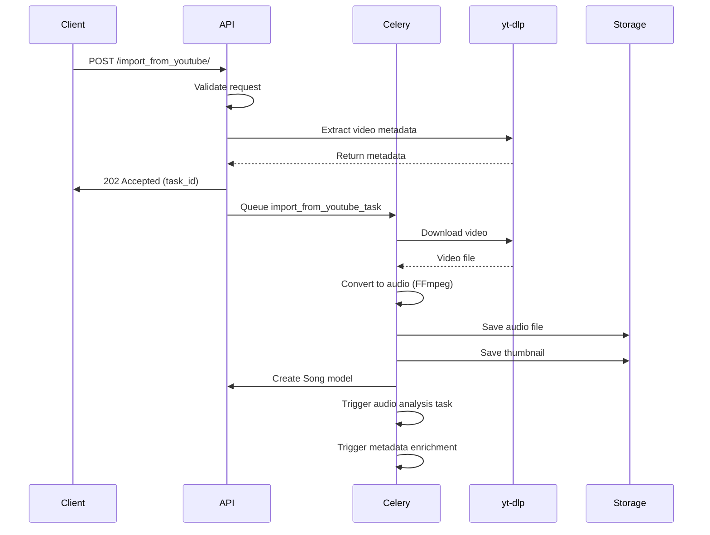

# YouTube Integration Guide

## Overview

The YouTube integration feature allows artists to import songs directly from YouTube URLs, automatically extracting audio, metadata, and thumbnail images. This feature uses `yt-dlp` for reliable video-to-audio conversion and integrates seamlessly with the existing song upload workflow.

## Architecture Decision

**Why `yt-dlp` over alternatives?**

- **Reliability**: `yt-dlp` is actively maintained and handles YouTube's frequent API changes
- **Format Support**: Supports multiple audio formats and quality levels
- **Metadata Extraction**: Automatically extracts title, artist, duration, and thumbnail
- **Error Handling**: Robust error messages for debugging

**Why Background Processing?**

Audio conversion and file processing are CPU-intensive operations. Using Celery tasks prevents blocking the API request and provides better user experience with progress tracking.

## Installation

### 1. Install System Dependencies

**Ubuntu/Debian:**
```bash
sudo apt-get update
sudo apt-get install ffmpeg yt-dlp
```

**macOS:**
```bash
brew install ffmpeg yt-dlp
```

**Windows:**
```bash
# Download FFmpeg from https://ffmpeg.org/download.html
# Install yt-dlp via pip
pip install yt-dlp
```

### 2. Install Python Package

Add to `Pipfile`:
```toml
[packages]
yt-dlp = ">=2024.0.0"
```

Then install:
```bash
pipenv install yt-dlp
```

Or via pip:
```bash
pip install yt-dlp
```

## Configuration

### Environment Variables

Add to `.env`:
```env
# Optional: YouTube API key for enhanced metadata (not required for basic import)
YOUTUBE_API_KEY=your-api-key-here

# Maximum file size for downloaded audio (in MB)
YOUTUBE_MAX_FILE_SIZE_MB=100

# Audio quality preference (best, worst, or specific format)
YOUTUBE_AUDIO_QUALITY=best
```

### Django Settings

No additional settings required. The integration uses existing media storage configuration.

## API Specification

### Endpoint: Import from YouTube

**URL:** `POST /api/music/songs/import_from_youtube/`

**Authentication:** Required (Token Authentication)

**Permission:** Artist role only

**Request Schema:**
```typescript
interface YouTubeImportRequest {
  youtube_url: string;           // Required: Full YouTube URL or video ID
  title?: string;                // Optional: Override extracted title
  genres?: string[];            // Required: Array of genre names
  album_id?: string;            // Optional: UUID of existing album
  album_title?: string;          // Optional: Create new album with this title
  release_date?: string;         // Optional: ISO date string (YYYY-MM-DD)
  visibility?: number;          // Optional: 1=Public, 2=Private (default: 1)
  licensing_info?: string;      // Optional: Licensing information
}
```

**Response Schema (Success - 202 Accepted):**
```typescript
interface YouTubeImportResponse {
  task_id: string;              // Celery task ID for tracking
  status: 'processing';
  message: string;
  estimated_duration?: number;  // Estimated processing time in seconds
  song_preview?: {
    title: string;
    duration: number;
    thumbnail_url?: string;
  };
}
```

**Response Schema (Error - 400 Bad Request):**
```typescript
interface YouTubeImportError {
  error: string;
  error_code?: string;          // Specific error code for client handling
  details?: {
    field?: string;              // Field name if validation error
    message: string;
  };
}
```

**Error Codes:**
- `INVALID_URL`: YouTube URL format is invalid
- `VIDEO_NOT_FOUND`: Video doesn't exist or is unavailable
- `AGE_RESTRICTED`: Video is age-restricted
- `PRIVATE_VIDEO`: Video is private
- `FILE_TOO_LARGE`: Audio file exceeds size limit
- `EXTRACTION_FAILED`: Failed to extract audio
- `GENRES_REQUIRED`: At least one genre must be provided

**Example Request:**
```bash
curl -X POST http://localhost:8000/api/music/songs/import_from_youtube/ \
  -H "Authorization: Token your-token-here" \
  -H "Content-Type: application/json" \
  -d '{
    "youtube_url": "https://www.youtube.com/watch?v=dQw4w9WgXcQ",
    "genres": ["Pop", "Rock"],
    "album_title": "Greatest Hits",
    "release_date": "2024-01-01"
  }'
```

**Example Response:**
```json
{
  "task_id": "a1b2c3d4-e5f6-7890-abcd-ef1234567890",
  "status": "processing",
  "message": "YouTube import started. Processing audio extraction...",
  "estimated_duration": 45,
  "song_preview": {
    "title": "Never Gonna Give You Up",
    "duration": 213,
    "thumbnail_url": "https://i.ytimg.com/vi/dQw4w9WgXcQ/maxresdefault.jpg"
  }
}
```

### Endpoint: Check Import Status

**URL:** `GET /api/music/songs/import_status/{task_id}/`

**Authentication:** Required

**Response Schema:**
```typescript
interface ImportStatusResponse {
  task_id: string;
  status: 'pending' | 'processing' | 'completed' | 'failed';
  progress?: number;            // 0-100 percentage
  song_id?: string;             // UUID of created song (when completed)
  error?: string;               // Error message (when failed)
  current_step?: string;        // Current processing step
}
```

## Implementation Details

### File Structure

```
music/
├── utils/
│   └── youtube_importer.py    # YouTube download and conversion logic
├── tasks.py                    # Celery task: import_from_youtube_task
└── viewsets.py                 # API endpoint: import_from_youtube action
```

### Processing Flow



### Code Location

**Main Implementation Files:**

1. **`music/utils/youtube_importer.py`** (Create this file)
   - `download_youtube_audio(url: str, output_path: str) -> dict`
   - `extract_video_metadata(url: str) -> dict`
   - `validate_youtube_url(url: str) -> bool`

2. **`music/tasks.py`** (Add to existing file)
   - `import_from_youtube_task(task_id: str, user_id: str, ...) -> dict`

3. **`music/viewsets.py`** (Add action to SongViewSet)
   - `@action(detail=False, methods=['post'])`
   - `def import_from_youtube(self, request) -> Response`

## Usage Examples

### Python Client

```python
import requests

API_URL = "http://localhost:8000/api"
TOKEN = "your-auth-token"

headers = {
    "Authorization": f"Token {TOKEN}",
    "Content-Type": "application/json"
}

# Import song from YouTube
response = requests.post(
    f"{API_URL}/music/songs/import_from_youtube/",
    json={
        "youtube_url": "https://www.youtube.com/watch?v=dQw4w9WgXcQ",
        "genres": ["Pop"],
        "album_title": "My Album"
    },
    headers=headers
)

task_data = response.json()
task_id = task_data["task_id"]

# Check status
status_response = requests.get(
    f"{API_URL}/music/songs/import_status/{task_id}/",
    headers=headers
)
print(status_response.json())
```

### JavaScript/TypeScript Client

```typescript
interface YouTubeImportParams {
  youtube_url: string;
  genres: string[];
  album_title?: string;
  release_date?: string;
}

async function importFromYouTube(params: YouTubeImportParams): Promise<string> {
  const response = await fetch('http://localhost:8000/api/music/songs/import_from_youtube/', {
    method: 'POST',
    headers: {
      'Authorization': `Token ${getAuthToken()}`,
      'Content-Type': 'application/json',
    },
    body: JSON.stringify(params),
  });

  if (!response.ok) {
    const error = await response.json();
    throw new Error(error.error || 'Import failed');
  }

  const data = await response.json();
  return data.task_id;
}

async function checkImportStatus(taskId: string) {
  const response = await fetch(
    `http://localhost:8000/api/music/songs/import_status/${taskId}/`,
    {
      headers: {
        'Authorization': `Token ${getAuthToken()}`,
      },
    }
  );
  return response.json();
}
```

## Error Handling

### Common Errors and Solutions

**1. "INVALID_URL" Error**
```json
{
  "error": "Invalid YouTube URL format",
  "error_code": "INVALID_URL"
}
```
**Solution:** Ensure URL includes `https://www.youtube.com/watch?v=` or `https://youtu.be/`

**2. "VIDEO_NOT_FOUND" Error**
```json
{
  "error": "Video not found or unavailable",
  "error_code": "VIDEO_NOT_FOUND"
}
```
**Solution:** Verify video exists and is publicly accessible

**3. "EXTRACTION_FAILED" Error**
```json
{
  "error": "Failed to extract audio from video",
  "error_code": "EXTRACTION_FAILED",
  "details": {
    "message": "FFmpeg conversion failed: [specific error]"
  }
}
```
**Solution:** 
- Verify FFmpeg is installed: `ffmpeg -version`
- Check available disk space
- Verify video format is supported

**4. "FILE_TOO_LARGE" Error**
```json
{
  "error": "Audio file exceeds maximum size limit",
  "error_code": "FILE_TOO_LARGE",
  "details": {
    "file_size_mb": 150,
    "max_size_mb": 100
  }
}
```
**Solution:** Use shorter videos or adjust `YOUTUBE_MAX_FILE_SIZE_MB` setting

## Security Considerations

### Input Validation

- URL validation prevents SSRF attacks
- File size limits prevent DoS via large downloads
- Rate limiting prevents abuse (implement via Django middleware)

### Legal Compliance

**Important:** Downloading copyrighted content from YouTube may violate:
- YouTube Terms of Service
- Copyright laws
- DMCA regulations

**Recommendations:**
1. Only allow artists to import their own content
2. Require explicit licensing information
3. Implement content verification workflow
4. Add disclaimer in UI about copyright compliance

## Performance Optimization

### Caching Strategy

- Cache video metadata for 24 hours to avoid repeated API calls
- Store thumbnail URLs instead of downloading immediately

### Background Processing

- Use Celery with Redis for task queue
- Implement task prioritization for premium users
- Add retry logic with exponential backoff

### Storage Optimization

- Compress audio files after conversion
- Use CDN for serving audio files in production
- Implement cleanup job for failed imports

## Testing

### Unit Tests

```python
# tests/test_youtube_importer.py
from music.utils.youtube_importer import validate_youtube_url, extract_video_metadata

def test_validate_youtube_url():
    assert validate_youtube_url("https://www.youtube.com/watch?v=test") == True
    assert validate_youtube_url("invalid-url") == False

def test_extract_video_metadata():
    # Mock yt-dlp response
    metadata = extract_video_metadata("https://www.youtube.com/watch?v=test")
    assert "title" in metadata
    assert "duration" in metadata
```

### Integration Tests

```python
# tests/test_youtube_import_api.py
from rest_framework.test import APIClient

def test_youtube_import_endpoint():
    client = APIClient()
    client.credentials(HTTP_AUTHORIZATION='Token ' + token)
    
    response = client.post('/api/music/songs/import_from_youtube/', {
        'youtube_url': 'https://www.youtube.com/watch?v=test',
        'genres': ['Pop']
    })
    
    assert response.status_code == 202
    assert 'task_id' in response.json()
```

## Troubleshooting

### Issue: yt-dlp not found

**Symptom:** `FileNotFoundError: yt-dlp command not found`

**Solution:**
```bash
# Verify installation
which yt-dlp

# If not found, install globally
sudo pip install yt-dlp
# Or use full path in code
```

### Issue: FFmpeg conversion fails

**Symptom:** `FFmpegError: Conversion failed`

**Solution:**
```bash
# Verify FFmpeg installation
ffmpeg -version

# Check codec support
ffmpeg -codecs | grep mp3
```

### Issue: Task stuck in "processing" state

**Symptom:** Task never completes

**Solution:**
1. Check Celery worker logs: `celery -A Spotify_Clone worker --loglevel=debug`
2. Verify Redis connection
3. Check task result backend configuration

## Future Enhancements

1. **Batch Import**: Import multiple videos in one request
2. **Playlist Import**: Import entire YouTube playlists
3. **Quality Selection**: Let users choose audio quality
4. **Progress Webhooks**: Real-time progress updates via WebSocket
5. **Metadata Enhancement**: Use YouTube Data API for richer metadata

## Related Documentation

- [Main README](../README.md) - Project overview
- [API Documentation](./API.md) - Complete API reference
- [Celery Configuration](../Spotify_Clone/celery.py) - Background task setup
